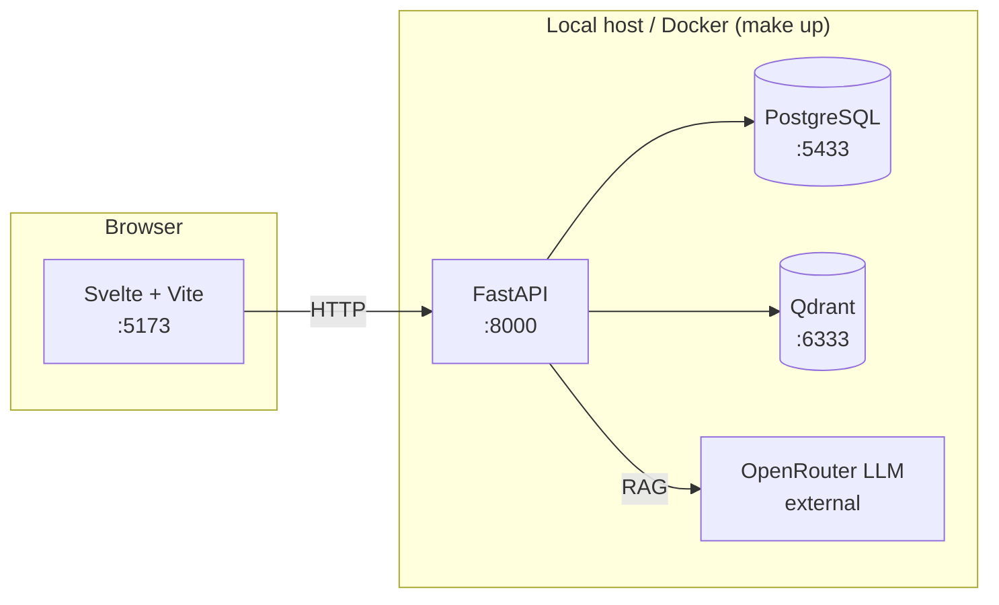

# qms-incub

A QMS tool for project managers at a large company: classify a software
project, get a generated compliance todo list, upload proof you've done
the work, and ask a chatbot grounded in the company's policy documents
(including ones synthetically generated or imported to stress-test the RAG
pipeline itself). Internal project — see below before you assume anything
about scope is final.

## Read this first

**The plan is still in early days and will change.** Before writing code
or opening a PR, read, in this order:

1. [`PLAN.md`](PLAN.md) — problem, solution, requirements, scope.
2. [`docs/adr/`](docs/adr/) — why each architectural decision was made,
   and what was rejected.
3. [`SLICES.md`](SLICES.md) — the actual build plan, one vertical slice at
   a time.
4. [`QUESTIONS.md`](QUESTIONS.md) — every decision made so far: decided,
   assumed (with the cost if the assumption is wrong), or deliberately
   deferred.

If something looks off, wrong, or missing — say so. Suggestions and
disagreement on any of this are welcome; nothing here is locked in.

[`CLAUDE.md`](CLAUDE.md) is the machine/agent-oriented counterpart to this
README: exact commands, build status, and workflow conventions, kept
current for whoever (human or agent) is about to work in the repo.

## Shape of the stack



Right now this is a walking skeleton: the frontend calls the backend's
`/health` endpoint and shows the result. Nothing else is built yet — see
`CLAUDE.md`'s build-status table and `SLICES.md` for what's next.

## Quick start

Requires Docker, [`uv`](https://docs.astral.sh/uv/), and Node 22+.

```bash
git clone https://github.com/leejianrong/qms-incub.git
cd qms-incub
make install        # backend + frontend dependencies
make install-hooks  # pre-push hook — run once
make up              # Postgres + Qdrant (Docker), backend :8000, frontend :5173
```

Open http://localhost:5173 — you should see "Backend health: ok". `make
down` stops the containers; Ctrl+C stops the dev servers.

## Configuration

| Variable | Where | Default | Purpose |
|----------|-------|---------|---------|
| `VITE_API_BASE` | `frontend/.env.local` (see `.env.example`) | `http://localhost:8000` | Where the frontend looks for the backend |

Postgres and Qdrant ports (`5433`, `6333`) are set in `docker-compose.yml`;
5433 rather than Postgres's usual 5432 to avoid colliding with a Postgres
already running on your machine.

## Contributing

Branch per slice, PR-only, pre-push hook mirrors CI — see `CLAUDE.md` for
the exact conventions and commands rather than duplicating them here.

## Status

Internal project, not for external distribution.
