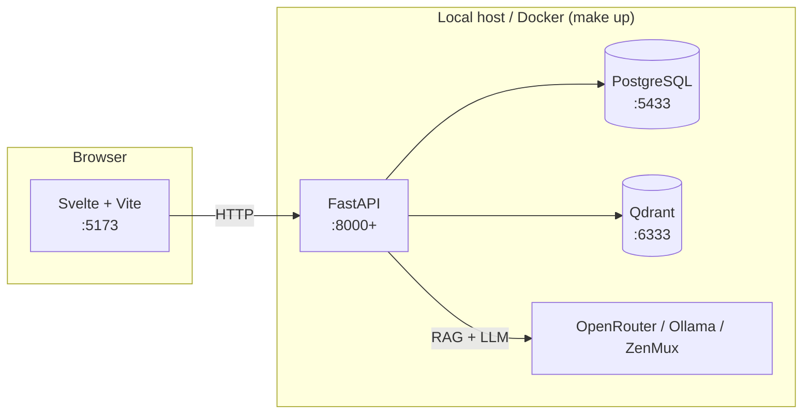

# qms-incub

A compliance console for project managers at a large company: classify a
software project, get a generated QMS todo list grouped by build phase,
upload evidence, track approval routing, and ask a policy chatbot grounded
in both the uploaded document corpus and the project's own compliance
state. Internal incubation project — the plan is still evolving, see
[Read this first](#read-this-first) before you assume anything about scope
is final.

## Screens

| Project console — plan navigator + grounded chat | PM dashboard |
|---|---|
|  |  |

More screens (project intake wizard, QA-author standard/clause/requirement
editor, blog/FAQ admin, document ingestion status) are in
[`docs/images/`](docs/images/).

## Read this first

**The plan is still in flux.** Before opening a PR, read, in this order:

1. [`PLAN.md`](PLAN.md) — problem, solution, requirements, scope.
2. [`docs/adr/`](docs/adr/) — why each architectural decision was made,
   and what was rejected.
3. [`SLICES.md`](SLICES.md) — the build plan, one vertical slice at a time.
4. [`QUESTIONS.md`](QUESTIONS.md) — every decision made so far: decided,
   assumed (with the cost if the assumption is wrong), or deliberately
   deferred.

Those docs describe *intent*. For what's actually built right now, see
[`AGENTS.md`](AGENTS.md)'s build-status table — it's kept current in the
same PR that changes what's built, and takes priority over stale claims
elsewhere. `AGENTS.md` is also the machine/agent-oriented counterpart to
this README (exact commands, workflow conventions); `CLAUDE.md` just
imports it, so Claude Code and any other agent read the same file.

If something looks off, wrong, or missing — say so. Disagreement on any of
this is welcome; nothing here is locked in.

## Shape of the stack



The backend only ever ingests documents and answers questions grounded in
them and in a project's compliance state — it never authors or generates
document content of any kind (ADR-0012). Real company QMS documents are
sensitive and not available yet, so a fully separate tool,
`synthetic-corpus/`, generates realistic QMS-shaped PDFs to exercise the
same pipeline — it shares no code with the backend and doesn't call it
over HTTP either.

## Quick start

Requires Docker, [`uv`](https://docs.astral.sh/uv/), and Node 22+.

```bash
git clone https://github.com/leejianrong/qms-incub.git
cd qms-incub
make install        # backend + frontend dependencies
make install-hooks  # pre-push hook — run once
cp backend/.env.example backend/.env  # fill in an OpenRouter key if you want one (see Configuration)
make up              # Postgres + Qdrant (Docker), backend, frontend :5173, in the foreground
```

`make up` prints which port it put the backend on — it tries `:8000` first
and falls back to `:8001`, `:8002`, ... if something else on your machine
already owns it (watch for a line like `Backend will run on port 8001`).
It wires the frontend's `VITE_API_BASE` to match automatically, so
`:5173` keeps working either way. `Ctrl+C` stops both dev servers;
`make down` also stops the Postgres/Qdrant containers.

> **Frontend port must stay `:5173`.** The backend's CORS is currently
> locked to `http://localhost:5173` (see `backend/src/qms_incub/main.py`)
> — there's no equivalent fallback wiring for the *frontend's* port. If
> something else already holds `:5173`, Vite will silently move to
> `:5174` and every API call breaks with a CORS error in the browser
> console. Free `:5173` first (`lsof -i :5173` / stop the other process)
> rather than trying to work around it.

In another terminal, seed a demo document (needs `make up` running):

```bash
make seed
```

Open http://localhost:5173, click **Create project**, then use the
floating **Ask QMS Assistant** widget on that project's page — chat is
project-scoped (V8), so it always needs a project to ground against, even
for a document-only question.

## Try the full workflow

The single seeded document is enough to prove ingestion+chat work, but the
real demo needs the 10-document synthetic policy corpus and a classified
project with generated todos:

```bash
# 1. Generate 10 realistic QMS-policy-shaped PDFs (no real/sensitive content — ADR-0012)
cd synthetic-corpus && uv sync && uv run python scripts/generate.py && cd ..

# 2. Ingest all of them the same way a real upload would (adjust the port if `make up` fell back)
for f in synthetic-corpus/output/POL-*.pdf; do
  curl -sf -F "file=@$f" http://localhost:8000/documents
done
```

Then, in the console: **Create project** → walk the 3-step wizard
(answer the classification questions to get a risk tier and a generated
todo list, grouped by process step) → open the project and ask the chat
widget a question that spans two policies, e.g.:

> If a proposed change requires provisioning new access to a system
> storing Confidential data, which policies apply and what does each one
> require?

It should cite both the Access Control (POL-006) and Data Classification
(POL-007) policies. Full walkthrough of what happens under the hood —
parsing, chunking, embedding, retrieval, reranking — is in
[`docs/rag-pipeline-walkthrough.md`](docs/rag-pipeline-walkthrough.md);
generating and using the synthetic corpus specifically is in
[`synthetic-corpus/README.md`](synthetic-corpus/README.md).

Other things worth trying once a project and the corpus exist: the QA-author
tools at `/editor` (author Standards → Clauses → Requirements) and
`/content` (draft and publish a blog post or FAQ entry — publishing adds
it to the same chat corpus as the PDFs); uploading a file against a todo
at `/project?id=...` to see self-attestation flip its approval state; and
the debug `POST /retrieve` endpoint to inspect raw retrieved chunks
without spending any LLM tokens.

Separately, `POST /aor/classify` routes an AOR PDF to R&T or SSD by
embedding-similarity against two reference descriptions — no LLM, Qdrant,
or Postgres involved, and it never touches the chat corpus. See
[`docs/aor-routing.md`](docs/aor-routing.md) for file layout and testing
it without the UI.

## Scoring retrieval quality

`rag-eval/` is a standalone tool (no HTTP dependency on the backend, but a
local `uv` path dependency on it) that scores retrieval — NDCG@k,
Recall@k, MRR — against a 110-question gold set derived from the
synthetic corpus:

```bash
cp rag-eval/.env.example rag-eval/.env   # keep values identical to backend/.env — see the doc below
cd rag-eval
uv run python -m rag_eval.build_goldset   # (re)build the gold set, only if the corpus/chunking changed
uv run python -m rag_eval                 # score retrieval: NDCG@k, Recall@k, MRR
```

See [`docs/rag-pipeline-walkthrough.md`](docs/rag-pipeline-walkthrough.md#scoring-retrieval-quality-rag-eval)
for how to read the report, a config gotcha specific to this tool
(it reads its *own* `.env`, not `backend/.env`), and how to point it at
ZenMux embeddings/reranking instead of the local/BM25 defaults.

## Configuration

> **2026-09-01 through 2026-09-05 only:** prefer `LLM_PROVIDER=zenmux` — a
> ZenMux API key was sent to the team separately for this promotional
> window (Q39, `QUESTIONS.md`). From 2026-09-06, this lapses automatically;
> go back to `openrouter` (preferred) or `ollama`, whichever you'd use
> normally.

Every variable is documented where it's read: `backend/.env.example` for
the backend and `rag-eval/.env.example` for the eval tool (a subset of the
same settings — no `DATABASE_URL`, since `rag-eval` never touches
Postgres). The ones worth knowing about up front:

| Variable | Where | Default | Purpose |
|----------|-------|---------|---------|
| `VITE_API_BASE` | `frontend/.env.local` (see `.env.example`) | `http://localhost:8000` | Where the frontend looks for the backend — `make up` sets this for you |
| `LLM_PROVIDER` | `backend/.env` | `ollama` | `ollama` (local, no key), `openrouter` (ADR-0003's decided default — needs `OPENROUTER_API_KEY`), or `zenmux` (needs `ZENMUX_API_KEY` — promotional window only, see above) |
| `EMBEDDING_PROVIDER` | `backend/.env` | `local` | `local` runs a small HuggingFace model in-process, no key needed. `openrouter`/`zenmux` call a hosted `/embeddings` endpoint instead. **Switching this requires re-ingesting the corpus** — it changes vector dimensionality, unlike `RETRIEVAL_MODE` |
| `RETRIEVAL_MODE` | `backend/.env` | `bm25` | `bm25` (sparse lexical) or `vector` (dense, via `EMBEDDING_PROVIDER`) — hot-swappable, no re-ingest needed |
| `RERANKER_PROVIDER` | `backend/.env` | `none` | `none`, `zenmux` (hosted cross-encoder), or `llm` (prompts whichever `LLM_PROVIDER` is already set) |
| `OPENROUTER_API_KEY` / `ZENMUX_API_KEY` | `backend/.env` | unset | Required only when the matching provider above is selected |

Postgres and Qdrant ports (`5433`, `6333`) are set in `docker-compose.yml`;
5433 rather than Postgres's usual 5432 to avoid colliding with a Postgres
already running on your machine.

## Contributing

Branch per slice, PR-only, pre-push hook mirrors CI — see
[`AGENTS.md`](AGENTS.md) for the exact conventions and commands rather
than duplicating them here.

## Status

Internal project, not for external distribution.
